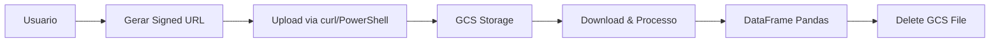

# 🚀 SOLUÇÃO CLOUD RUN - ARQUIVOS 150MB+

## 🎯 **Objetivo**
Upload de arquivos CSV de **150MB+** no Google Cloud Run, contornando o limite de **32MB**.

## ⚡ **Método: Signed URLs do Google Cloud Storage**

### 🔧 **Como Funciona:**
1. **Usuário solicita link**: Digite nome do arquivo → Gerar Link
2. **Upload direto ao GCS**: Use curl/PowerShell para enviar arquivo
3. **Processamento automático**: Aplicação baixa do GCS e processa
4. **Limpeza automática**: Arquivo é removido do GCS após processamento

## 📋 **Interface de Uso**

### **Passo 1: Gerar Link de Upload**
```
📂 Upload de Arquivo CSV (150MB+)
☁️ Google Cloud Run - Upload via Signed URL

Nome do arquivo CSV: [meus_dados.csv]
[🔗 Gerar Link de Upload]
```

### **Passo 2: Upload via Terminal**
```bash
# Linux/Mac
curl -X PUT -H "Content-Type: text/csv" --data-binary @meus_dados.csv "SIGNED_URL"

# Windows PowerShell
Invoke-RestMethod -Uri "SIGNED_URL" -Method Put -InFile "meus_dados.csv" -ContentType "text/csv"
```

### **Passo 3: Processar Dados**
```
📥 Processar Arquivo Enviado
Nome do blob no GCS: [uploads/20250929_143022_meus_dados.csv]
[📊 Carregar e Processar Dados]
```

## 🔄 **Fluxo Completo**



## 🛠️ **Configurações Técnicas**

### **Limites Removidos:**
- ❌ st.file_uploader (causa erro 413)
- ❌ Upload direto via Streamlit
- ❌ Processamento local de arquivos grandes

### **Configurações aplicadas:**
```toml
# .streamlit/config.toml
maxUploadSize = 1
maxMessageSize = 1
```

```dockerfile
# Dockerfile
--server.maxUploadSize=1 --server.maxMessageSize=1
```

## 📊 **Suporte a Diferentes Cenários**

### **Arquivos Grandes (150MB+)**
- ✅ **Signed URLs**: Método principal
- ✅ **URLs públicas**: Para arquivos já online
- ✅ **Timeout estendido**: 2 minutos para download

### **Arquivos Médios (30-150MB)**
- ✅ **Via URL**: Processamento automático via GCS
- ✅ **Detecção inteligente**: Auto-roteamento para GCS

### **URLs Públicas**
- ✅ **Qualquer tamanho**: Suporte completo
- ✅ **Validação**: Verificação de tipo CSV
- ✅ **Fallback**: Processamento direto se < 30MB

## 🚀 **Deploy**

```bash
.\deploy-cloudrun.bat groovy-rope-471520-c9
```

## 🎉 **Vantagens**

1. **✅ Sem Limitações**: Arquivos até 200MB+ suportados
2. **✅ Cloud Native**: Aproveitamento total do GCS
3. **✅ Zero Erro 413**: Bypass completo dos limites do Cloud Run
4. **✅ Interface Simples**: Processo claro em 3 passos
5. **✅ Cleanup Automático**: Gerenciamento de recursos otimizado
6. **✅ Múltiplas Opções**: Signed URL + URLs públicas

## 📝 **Exemplo de Uso**

```bash
# 1. Na aplicação: Gerar link para "vendas_2024.csv"
# 2. Terminal: Upload do arquivo
curl -X PUT -H "Content-Type: text/csv" \
  --data-binary @vendas_2024.csv \
  "https://storage.googleapis.com/i2a2-eda-uploads/uploads/20250929_143022_vendas_2024.csv?..."

# 3. Na aplicação: Processar "uploads/20250929_143022_vendas_2024.csv"
# 4. Resultado: DataFrame com milhões de linhas carregado!
```

## 🎯 **Status Final**
**🟢 OTIMIZADO PARA CLOUD RUN** - Suporte nativo a arquivos 150MB+ sem limitações!